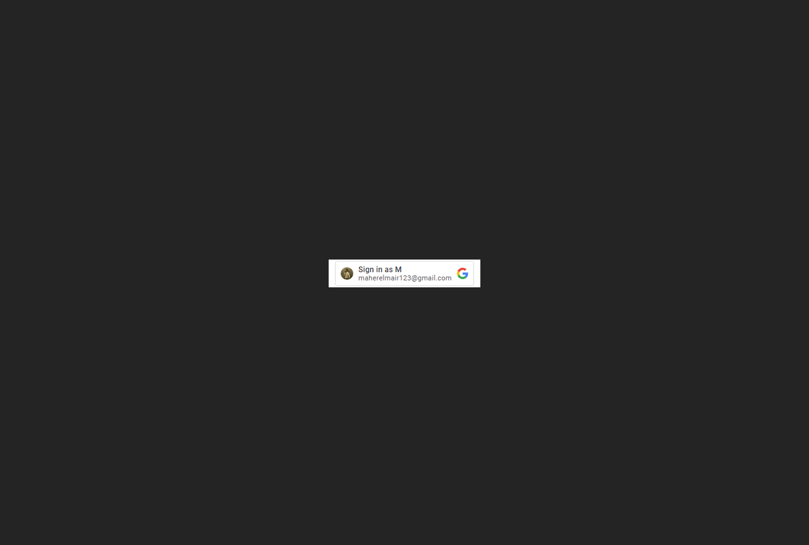
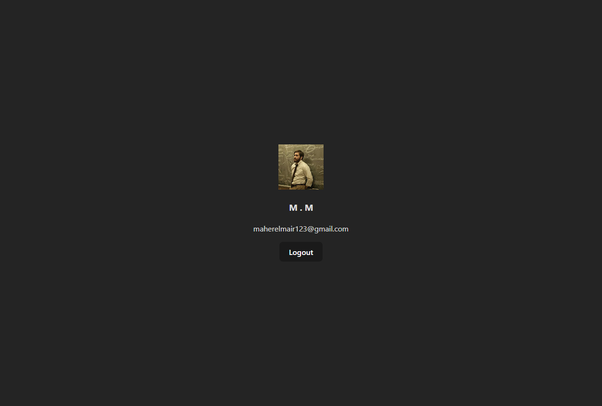

# 🔐 Google-auth-app

**A simple and clean Google OAuth login app built with React.**  

> This project demonstrates how to implement Google login in a React application using `@react-oauth/google`. Users can securely sign in with their Google accounts, view their profile details, and log out. A perfect starter project for learning OAuth authentication and handling user sessions.

---

## 📖 Project Description

This project provides a minimal and effective Google authentication flow using React:

- Login using Google account.
- Decode the JWT to retrieve user information.
- Display user name, email, and profile picture.
- Provide logout functionality that clears the session.

---

## ✅ Features

- 🔐 Google OAuth 2.0 login flow  
- 👤 Display logged-in user's profile picture, name, and email  
- 🚪 Logout and clear session  
- ⚙️ JWT decoding using `jwt-decode`  
- 🧼 Clean and minimal UI  
- 🔄 Auto-select previously logged-in account if available  

---

## 🧠 React Concepts Used

| Concept                  | Usage                                      |
|--------------------------|--------------------------------------------|
| `useState`               | Store and manage user session              |
| `conditional rendering`  | Toggle UI based on authentication state    |
| `event handling`         | Handle login success/error and logout      |
| `3rd-party integration`  | Google OAuth and JWT decoding              |

---

## 🧰 Tools & Libraries

| Tool                    | Purpose                                    |
|-------------------------|--------------------------------------------|
| **React**               | Build components and manage state          |
| **@react-oauth/google** | Handle Google login integration            |
| **jwt-decode**          | Decode JWT token from Google login         |
| **Vite**                | Frontend build tooling                     |
| **CSS**                 | Basic styling                              |
| **gh-pages**            | Deploy project to GitHub Pages             |

---

## 📸 Screenshots

### 🔐 Login View

### 👤 User Profile View

---

## 📝 Notes

- This is a front-end only demo; no backend or token storage.
- For real-world apps, use secure token handling and backend verification.
- Can be extended with `localStorage`, `Context API`, or `Firebase`.

---

## 🧑‍💻 Author

**Maher Elmair**

- 📫 [maher.elmair.dev@gmail.com](mailto:maher.elmair.dev@gmail.com)
- 🔗 [LinkedIn](https://www.linkedin.com/in/maher-elmair)
- ✖️ [X (Twitter)](https://x.com/Maher_Elmair)  
- ❤️ Made with passion by [Maher Elmair](https://maher-elmair.github.io/My_Website)

---

## 🔗 Live Preview

🚀 **Try it live on GitHub Pages:**  

🌍 [Live Link](https://maher-elmair.github.io/google-auth-app/)

---

## 🙌 Thank You

If you find this project helpful, feel free to ⭐ the repository!  
Suggestions, issues, and contributions are always welcome 🙏

---